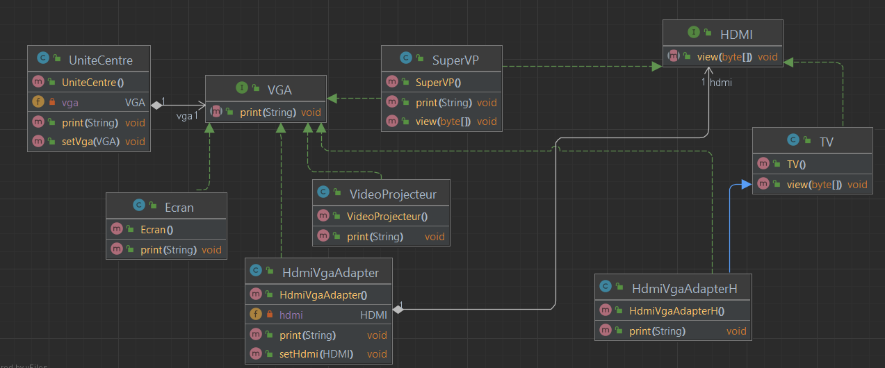

<h2>Design Pattern "Adapter"</h2>

Le design pattern "Adapter," est un modèle de conception structurel. L'objectif principal de ce pattern est de permettre à des objets aux interfaces incompatibles de travailler ensemble. Cela se fait en créant un adaptateur qui agit comme une interface intermédiaire pour relier ces objets.

En bref, voici comment fonctionne le pattern Adaptateur :

Objet Cible (Target) : C'est l'interface que vous souhaitez utiliser dans votre application. C'est ce avec quoi vous voulez interagir, mais cela peut avoir une interface incompatible.

Adaptateur (Adapter) : L'adaptateur est un composant qui implémente l'interface de l'objet cible et "adapte" les appels de l'objet client à l'objet cible en les convertissant en un format compréhensible pour l'objet cible.

Objet Adapte (Adaptee) : Il s'agit de l'objet avec l'interface incompatible que vous voulez utiliser, mais il ne correspond pas à l'interface de l'objet cible.

L'adaptateur permet donc à l'objet client d'interagir avec l'objet cible en masquant les différences d'interface. Cela améliore la réutilisation du code et la compatibilité entre les composants.

<h3>Structure du projet</h3>

<h3>Diagramme de classe</h3>

