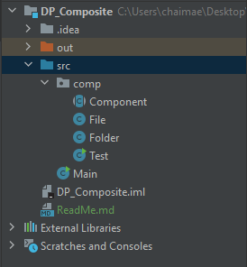
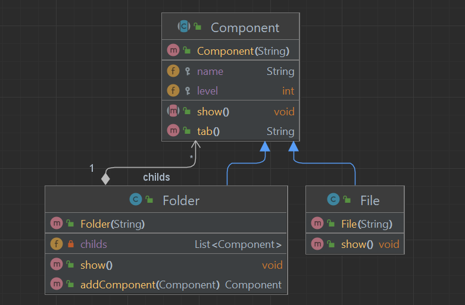

<h2>Design Pattern "Composite"</h2>

Le design pattern Composite est un modèle de conception qui fait partie du groupe des modèles structurels. Il est utilisé pour créer des structures d'objets complexes en organisant les objets en une hiérarchie arborescente. Le motif Composite permet aux clients de traiter individuellement les objets simples et les compositions d'objets de la même manière.

En bref, voici les caractéristiques clés du design pattern Composite en français :

1. **Composition hiérarchique** : Le motif Composite organise les objets en une structure arborescente où les objets simples et les compositions d'objets sont traités de manière uniforme.

2. **Composants** : Il définit deux types de composants : les feuilles (leaf), qui sont les objets individuels, et les composites, qui sont des collections d'objets (y compris d'autres composites).

3. **Interface commune** : Les composants (feuilles et composites) implémentent une interface commune qui permet aux clients d'interagir avec eux de la même manière.

4. **Récursion** : Les opérations peuvent être récursivement appliquées à la structure arborescente, ce qui facilite le traitement des objets complexes sans se soucier de leur profondeur dans la hiérarchie.

5. **Exemple d'utilisation** : Un exemple courant d'utilisation du modèle Composite est la représentation d'une structure hiérarchique dans un document, où un document peut contenir des sections, des sous-sections, du texte, des images, etc.

<h3>Structure du projet</h3>

<h3>Diagramme de classe</h3>

