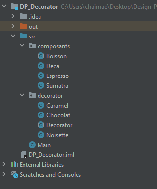
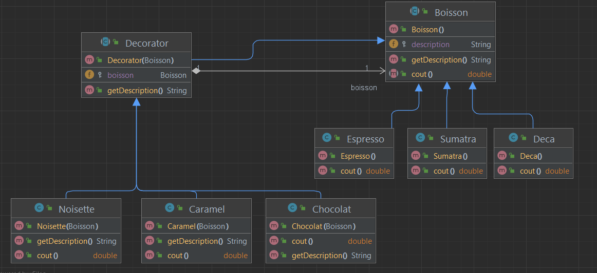

<h2>Design Pattern "Decorator"</h2>

Le design pattern Decorator (ou le patron de conception Décorateur en français) est un modèle de conception structurel qui permet d'ajouter des fonctionnalités supplémentaires à des objets existants de manière flexible et dynamique, sans altérer leur structure de base. Ce modèle est couramment utilisé pour étendre les fonctionnalités des classes existantes sans avoir à créer des sous-classes excessives.

Voici un résumé des principaux concepts du design pattern Décorateur en français :

Composant (Component) : C'est l'interface ou la classe de base qui définit le comportement de base de l'objet que vous souhaitez décorer. Les composants concrets implémentent cette interface.

Décorateur (Decorator) : C'est une classe abstraite qui implémente l'interface du composant. Elle contient une référence à un objet de type composant. Le décorateur ajoute ou modifie le comportement de l'objet composant en délégant des opérations à cet objet.

Décorateurs Concrets (Concrete Decorators) : Ce sont les classes qui étendent le décorateur abstrait. Ils ajoutent des fonctionnalités spécifiques à l'objet composant en implémentant les méthodes du décorateur abstrait.

Objet Composant Concret (Concrete Component) : C'est l'objet de base auquel vous ajoutez des fonctionnalités à l'aide de décorateurs concrets. Il implémente l'interface du composant.

Le design pattern Décorateur permet d'assembler des objets décorateurs pour créer une pile de fonctionnalités emboîtées autour d'un objet composant de base. Cela offre une flexibilité considérable, car vous pouvez ajouter, supprimer ou remplacer des décorateurs sans modifier la classe de l'objet composant.

<h3>Structure du projet</h3>

<h3>Diagramme de classe</h3>

