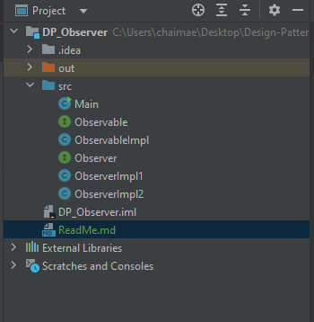
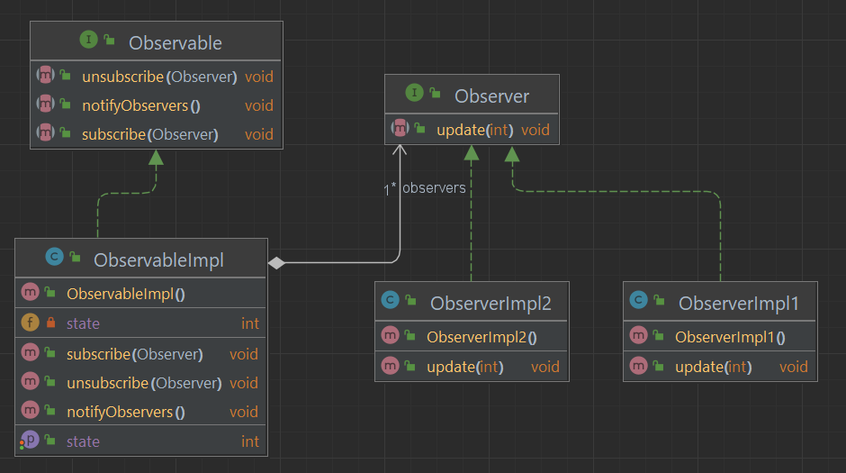

<h2>Design Pattern "Observer"</h2>

Le design pattern Observer, également connu sous le nom de modèle de conception Observateur, est l'un des patrons de conception du logiciel les plus couramment utilisés. Il est classé dans la catégorie des patrons de conception comportementaux. Le modèle Observer est principalement utilisé pour établir une relation de dépendance un-à-plusieurs entre objets, de telle sorte que lorsqu'un objet (appelé le sujet ou l'observable) change son état, tous ses observateurs (ou abonnés) sont notifiés et mis à jour automatiquement.

Voici comment fonctionne le design pattern Observer :

Sujet (Observable) : C'est l'objet qui est surveillé. Il maintient une liste d'observateurs et les informe de tout changement d'état. Le sujet expose des méthodes pour permettre aux observateurs de s'abonner (s'inscrire) et de se désabonner (se désinscrire) pour les notifications.

Observateur : Ce sont les objets qui souhaitent être informés des changements d'état du sujet. Ils implémentent une interface ou une classe abstraite qui définit la méthode de mise à jour. Lorsque le sujet notifie les observateurs, ils exécutent leur logique de mise à jour en réponse au changement d'état du sujet.

L'avantage principal de ce modèle est la séparation entre le sujet et ses observateurs. Le sujet ne sait pas qui sont ses observateurs, il ne fait qu'envoyer des notifications. Cela permet une extension facile du système, car de nouveaux observateurs peuvent être ajoutés sans avoir à modifier le sujet.

Le modèle Observer est couramment utilisé dans des domaines tels que les interfaces utilisateur (pour mettre à jour automatiquement l'interface en fonction des changements de données), les systèmes de diffusion (publier/abonner), et la gestion d'événements.

<h3>Structure du projet</h3>

<h3>Diagramme de classe</h3>

