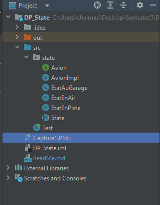
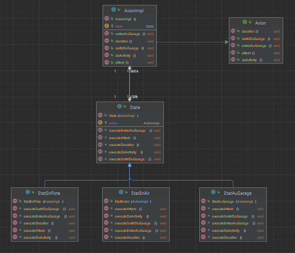

<h2>Design Pattern "Proxy"</h2>

Le design pattern "Proxy" est un patron de conception qui agit comme un intermédiaire entre un client et un objet réel. Il permet de contrôler l'accès à l'objet réel en ajoutant une couche d'abstraction. Le Proxy peut être utilisé pour diverses raisons, telles que la mise en cache, la gestion de la sécurité, la journalisation, ou la création paresseuse d'objets coûteux. 

<h3>Structure du projet</h3>

<h3>Diagramme de classe</h3>

