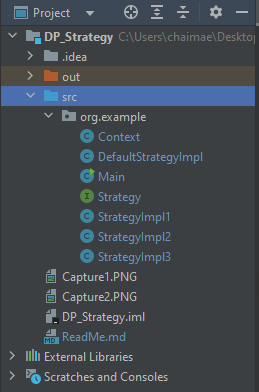

<h2>Design Pattern "Strategy"</h2>

Le design pattern Strategy est un modèle de conception qui fait partie du groupe des design patterns comportementaux. Il est utilisé pour définir une famille d'algorithmes, encapsuler chacun d'eux et les rendre interchangeables. Le pattern Strategy permet à un client de choisir dynamiquement l'algorithme approprié parmi plusieurs algorithmes disponibles. Cela favorise la flexibilité, la réutilisation du code et la facilité de maintenance.

Le pattern Strategy se compose généralement des éléments suivants :

Contexte (Context) : C'est la classe qui contient une référence à l'objet de stratégie et peut interagir avec lui. Le contexte délègue souvent le travail à l'objet de stratégie.

Stratégie (Strategy) : C'est une interface ou une classe abstraite qui définit un ensemble d'algorithmes. Chaque stratégie représente un algorithme particulier.

Implémentations de Stratégie (Concrete Strategies) : Ce sont les classes concrètes qui implémentent l'interface ou la classe abstraite de stratégie. Chaque classe représente un algorithme spécifique.

Lors de l'utilisation du pattern Strategy, le client peut choisir l'algorithme souhaité et l'associer dynamiquement avec le contexte. Cela permet au contexte de varier son comportement en fonction de l'algorithme sélectionné, sans modifier son code sourc

<h3>Structure du projet</h3>

<h3>Diagramme de classe</h3>

