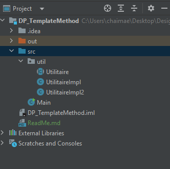
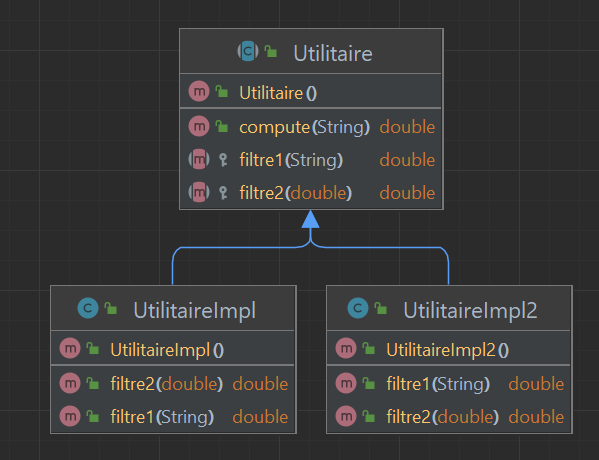

<h2>Design Pattern "Template Method"</h2>

Le design pattern "Template Method" (Modèle de Méthode) est un modèle de conception comportemental qui permet de définir le squelette d'un algorithme dans une classe de base, tout en permettant aux sous-classes de redéfinir certaines étapes de cet algorithme sans changer sa structure globale. En français, on le nomme souvent "Patron de Méthode Modèle".

En bref, voici comment il fonctionne :

1. Une classe de base (souvent appelée "classe abstraite") définit une méthode template (ou modèle) qui représente l'algorithme de base. Cette méthode contient les étapes de l'algorithme, mais certaines de ces étapes peuvent être des méthodes abstraites, laissant ainsi aux sous-classes la responsabilité de les implémenter.

2. Les sous-classes héritent de la classe de base et peuvent redéfinir les méthodes abstraites pour personnaliser certaines étapes de l'algorithme, tout en laissant les autres étapes inchangées.

3. Lorsque vous utilisez ce modèle, vous appelez la méthode template de la classe de base, qui exécute l'algorithme dans l'ordre défini, en utilisant les implémentations fournies par les sous-classes pour les étapes personnalisées.

Le "Template Method" favorise la réutilisation du code, la cohérence de l'algorithme de base, tout en permettant des variations spécifiques dans les sous-classes. C'est couramment utilisé dans le développement logiciel pour gérer des workflows ou des procédures standardisées, tout en permettant des adaptations spécifiques à chaque cas d'utilisation.

<h3>Structure du projet</h3>

<h3>Diagramme de classe</h3>

